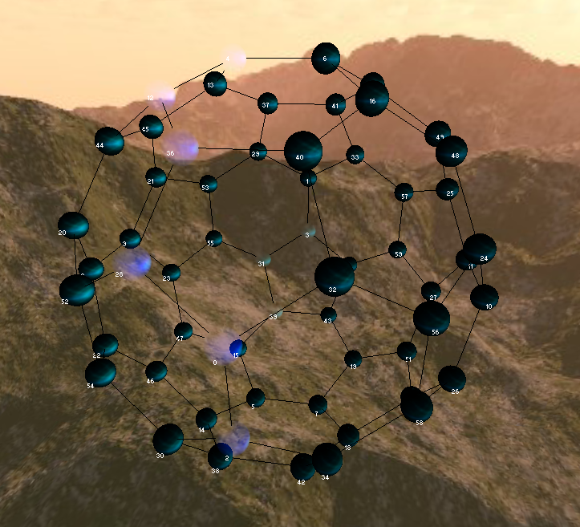

# Path planning visualisation using the A* algorithm

Path planning visualisation using the A* path planning algorithm. Demonstrated using a buckminsterfullerene ball to show node traversal.

## Getting Started

Clone and run in visual studio. 

## Instructions

Run the project. Choose a path using the console dialog. The path taken is shown by the light coloured nodes.

## Screenshots

## Built With

* Irrlicht

## Authors

* **Geoff Whitehead - (https://github.com/geoffwhitehead)

## License

This project is licensed under the MIT License - see the [LICENSE.md](./LICENSE.md) file for details
